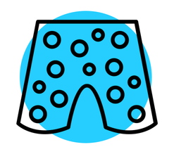

# Shorts
Hmm.. So, you need a url shortener service on the hand, yah? You're in the rigth place!

[](https://www.codacy.com/app/mematheuslc/shorts?utm_source=github.com&utm_medium=referral&utm_content=matheuslc/shorts&utm_campaign=badger)
[](https://travis-ci.org/matheuslc/shorts)
[](https://coveralls.io/github/matheuslc/shorts?branch=master)



OH! How I run this!? :0

* You must have a MongoDB running 

* Set your configuratons at resource/enviroment-sample.json

* Rename this file to enviroment.json

* Run the container

```bash
docker run -p 3000:3000 --name shorts -d matheuslc/shorts
```

If you aren't using docker, no problem!

* Clone the project
* yarn or npm install
* node bin/ww
* Running on port 3000

YES! Now you have a.... an awesome url shortener service running on localhost:3000! Really, try it:

## Create a new short URL

* Method: POST
* API: //localhost:3000

Send the URL at the request body

## Redirect request from a short url

* Method: GET
* API: //localhost:3000/aXd79

The user will be redirect to the origin URL

## Delete a Short URL

* Method: DELETE
* API: //loalhost:3000/axd79

# Send a pull request, please!
Oh, Thank you! To run the development enviroment do that:

```bash
docker-compose up
```

Now you have shorts running on port 3000 and a MongoDB container running on port 27017.

## Without docker

* Clone the project
* yarn or npm install
* node bin/www
* Running on port 3000!

# Dependencies
* Node.js (>6). You can try older versions too.
* MongoDB

